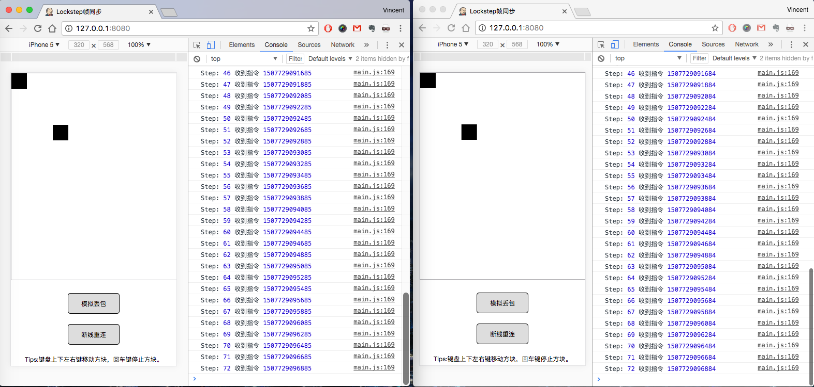

## 帧同步网页小游戏
一个乐观帧同步的最简单示例。
* node.js+socket.io开发
* **支持断线重连**

相关代码解析请参考我的博客：  
[《帧同步的实现Part1 - 客户端与服务端》](http://www.jianshu.com/p/5a6d25db3914)  
[《帧同步的实现Part2 - 断线重连》](http://www.jianshu.com/p/099196b0204d)  
## 如何运行
* 服务端
```shell
$ cd server
$ npm install
$ node app.js
```

* 客户端（也可使用任意方法启动一个web服务）
```shell
$ cd client
$ python3 -m http.server 8080
```

* 启动完成后访问：[http://127.0.0.1:8080/](http://127.0.0.1:8080/)

## 示例截图
